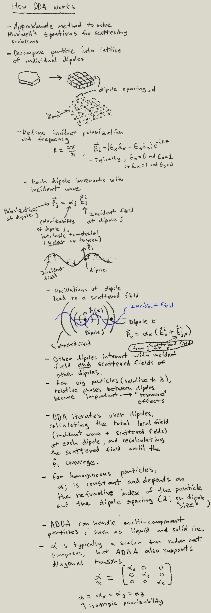

# ADDA notes

- [Introduction to DDA](#section-1)
- [Scattering amplitude matrices](# Section 2)
- [Euler rotation angles](# Section 3)
- [Scattering geometry](# Section 4)
- [Custom planar shapes in ADDA](# Section 5)

# Section 1

# Section 2

# Section 3

# Section 4

# Section 5

